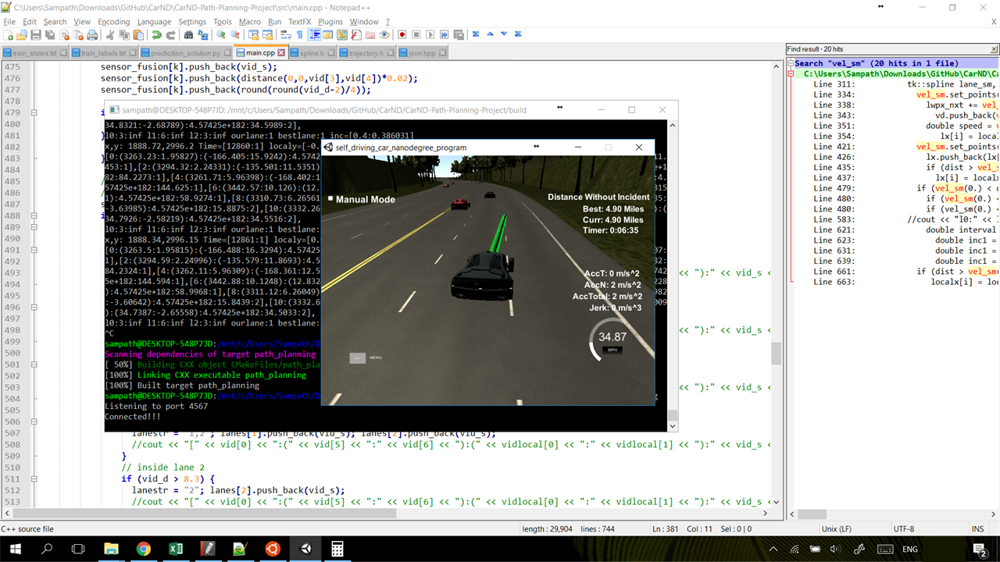

# Term 3 Project 1: Path Planning Project

The simulator (version 1.2) was obtained from the Path Planning Project [releases tab](https://github.com/udacity/self-driving-car-sim/releases).

The project was coded in C++ and implemented the ad-hoc path planner for safe and comfortable lane change trajectories. The implementation was done under the following constraints.

1. Highway system is a 3-lane highway. Path planning and lane change trajectory planning was done for single side of the highway. Traffic on the other side of road was ignored.

2. The data returned by the simulator is:

    i. Vehicle position, speed and other data

    ii. Localization information from Sensor Fusion, i.e., position, speed and other data

    iii. coordinate of waypoints around the track. The next trajectory is planned using this information

3. Speed limit is 50 MPH with a margin of 10 MPH.

4. The magnitude of acceleration (m/s^2) and jerk (m/s^3) may not exceed 10.

5. The vehicle cannot collide with other vehicles on the track and should always drive in the right direction (no wrong ways).

6. Vehicle should complete at least one loop around the 4.32 mile (6.95 kms) long track.

## Code walkthrough

There are ample comments provided along the code and most are self explanatory. Key code elements that require in-depth discussion are provide in the following listing.

1. The data returned by the simulator on main car and other vehicles in the vicinity is processed in lines 275-291. The details of the telemetry data are as follows:

  * ["x"] The main car's x position in map coordinates
  * ["y"] The main car's y position in map coordinates
  * ["s"] The main car's s position in frenet coordinates
  * ["d"] The main car's d position in frenet coordinates
  * ["yaw"] The car's yaw angle in the map
  * ["speed"] The car's speed in MPH
  * ["previous_path_x"] The previous list of x points previously given to the simulator
  * ["previous_path_y"] The previous list of y points previously given to the simulator
  * ["end_path_s"] The previous list's last point's frenet s value
  * ["end_path_d"] The previous list's last point's frenet d value
  * ["sensor_fusion"] A 2d vector of cars and then that car's [car's unique ID, car's x position in map coordinates, car's y position in map coordinates, car's x velocity in m/s, car's y velocity in m/s, car's s position in frenet coordinates, car's d position in frenet coordinates. 

2. Helper function to evaluate and fit polynomial functions are listed in lines 116-147.

3. Helper functions to transformed data betwen local and global coordinate systems are listed in lines 149-204.

4. Before the new path can be planned, some basic checks are done. These are as follows:

  * Check for wrong way (lines 319-325).
  * If no path exists (fresh start), then initialize a path segment using a smooth point set (lines 327-342).
  * Smothen and convert path from local to global coordinates. Note that the path planning is done in local frenet coordinates.

5. For path planning in local frenet coordinates, the current lane of main vehicle and other vehicles is identified in lines 480-510. Based on current location of the main car and other cars, the best lane to transition is identified using a finite state representation. Although, Djikstra or A* planners can be used to identify the best path in frenet coordinate (s-d), the implementation was kept simple.

6. Since the main vehicle uses a perfect controller and will visit every (x,y) point it recieves in the list every 2 milliseconds, the maximum distance increment to the new path was limited to 0.445 m (which converts to maximum 50 mph). In the present submission, the decision making process to identify the target lane and velocity is implemented in lines 579-619.

7. In present implementation, the constraints for maximum acceleration and jerk are satisfied indirectly. That is, the points are adjusted using ad-hoc fractional mixing (see lines 593-619). These are further processed using the [spline function](http://kluge.in-chemnitz.de/opensource/spline/) to obtain smooth trajectories. The ideal way to do this is to assume to use a cubic polynomial and enforce acceleration and jerk constraints to obtain a smooth polynomial. The current location along with planner points can be used to obtain new points to meet this constraint.

8. To remedey the latency in the simulator and the compiled code, the new path was extended smoothly while using the datapoints from previous_path_x, and previous_path_y (see lines 621-656).

## Dependencies to be resolved for succesful build

The build process was completed on Bash for Windows. Bash for Windows was obtained and installed using instructions from [here](https://msdn.microsoft.com/en-us/commandline/wsl/install_guide). Following this, the build environment was prepared using the following

1. `sudo apt-get install build-essentials`

2. `sudo apt-get install cmake`

3. Install [uWebSockets](https://github.com/uWebSockets/uWebSockets) using `install-ubuntu.sh`. It was essential to get branch `e94b6e1` to ensure compatibility with cmake. Newer version of uWebSockets does not use cmake.

## Build steps followed for building executable

Once the above dependencies were resolved, the following steps were used to build the executable for path planning project.

1. Clone the [Udacity Github Repo](https://github.com/udacity/CarND-Path-Planning-Project).

2. Update the `main.cpp` source file.

3. Make a build directory: `mkdir build && cd build`

4. Compile: `cmake -DCMAKE_BUILD_TYPE=RelWithDebInfo .. && make`

    NOTE: The above `cmake` flag is essential to resolve the anonymous namespaces in `spline.h`. If the above flag is not used, then `Assertion 'x.size()==y.size()' failed` error may be encountered one line 288 of `spline.h` file.

Once the executable is complied, it can be run using `./path_planning`.

Once the executable is running, the simulator is started. The executable was successfully tested with the simulator and the vehicle was able to finish a lap without incidents around the track. It is noted that there were 4-5 unsuccessful attempts in the initial stages due to a crowded vehicle field in front of the car. But after 2 laps around the track, the vehicle field was spread out, and the simulator eventually completed a lap with any incidents. The following images shows the successful completion of the requirements.

